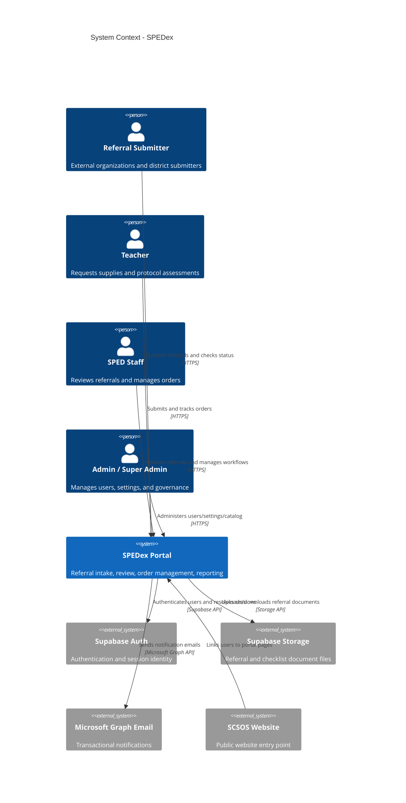
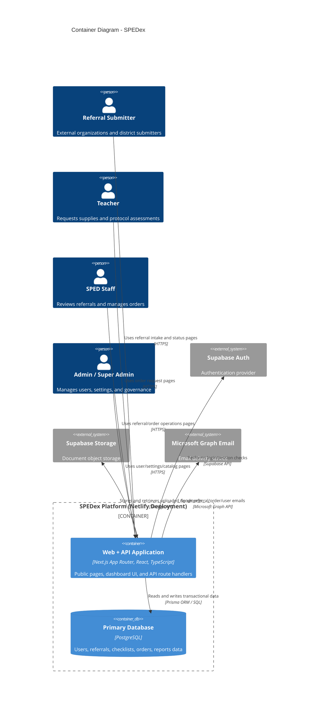

# SPEDex Project Context for LLMs

Last updated: 2026-03-07

## Why this document exists

This file gives an LLM enough context to:

- understand what the product does today
- map workflows to pages, APIs, and schema
- identify gaps and roadmap opportunities
- reason about role-based access and compliance constraints

---

## Product Summary

SPEDex (Sutter County Superintendent of Schools) is a Next.js web app that digitizes two core operational systems:

- Special education referral intake/review (including document packets and checklist review)
- Internal order management (supplies + protocol/assessment ordering)

It combines:

- public-facing intake/status pages for submitters
- staff dashboard pages for review/operations
- role-based API/backend logic
- email notifications and document storage

---

## Workflows Being Digitized

## 1) Referral intake and review

What exists now:

- Public multi-form referral intake:
  - Interim (`INTERIM`)
  - DHH Itinerant (`DHH_ITINERANT`)
  - Level II (`LEVEL_II`)
- Confirmation number generation (`REF-YYYY-MM-DD-XXX`)
- Public status lookup by confirmation number
- Staff review flow:
  - assign referral to staff
  - checklist item-level review (`PENDING`, `ACCEPTED`, `REJECTED`, `MISSING`)
  - status transitions (e.g., `SUBMITTED`, `UNDER_REVIEW`, `APPROVED`, `REJECTED`, etc.)
  - notes + status history timeline
- Document upload/re-upload tied to checklist items
- Email notifications for submission and status changes

From discovery context, this digitizes manual Google Sheet tracking fields such as:

- student name
- primary disability
- grade
- DOR/submission timing
- silo
- assigned teacher/staff

## 2) Order request and fulfillment

What exists now:

- Standard supply order submission by requestors
- Protocol/assessment order submission tied to catalog
- Order number generation (`ORD-YYYY-MM-DD-XXX`)
- Staff management of order status and operational metadata
- Order notes + status history
- Role-aware “my orders” vs “all orders”
- Email notifications for order submitted and status changes

## 3) User onboarding and administration

What exists now:

- login/signup/forgot-password
- pending approval gate for inactive users
- admin user management:
  - create user
  - invite/resend invite
  - reset password link
  - activate/deactivate
  - edit role/profile fields

## 4) Reporting and operational visibility

What exists now:

- Enrollment Projections report (filterable, exportable)
- Class List page (filter/sort/export)
- Dashboard activity feed + quick stats
- Staff changelog page sourced from `USER-CHANGES.md`

---

## Roles and Access Model

System roles (`UserRole` enum):

- `EXTERNAL_ORG`
- `TEACHER`
- `SPED_STAFF`
- `ADMIN`
- `SUPER_ADMIN`

Core permission patterns:

- Referral full access (`referrals:view-all`, `referrals:update`): `SPED_STAFF`, `ADMIN`, `SUPER_ADMIN`
- Referral submit: `EXTERNAL_ORG`, `SPED_STAFF`, `ADMIN`, `SUPER_ADMIN`
- Order submit/view-own: `TEACHER`, `SPED_STAFF`, `ADMIN`, `SUPER_ADMIN`
- Order view-all/manage: `SPED_STAFF`, `ADMIN`, `SUPER_ADMIN`
- User management: mostly `ADMIN`, `SUPER_ADMIN`
- Changelog view: `SPED_STAFF`, `ADMIN`, `SUPER_ADMIN`

Special rule:

- `My Orders` for `SPED_STAFF` is restricted by job title keywords (`nurse`, `speech`, `psych`) via `canAccessMyOrders`.

---

## Page Inventory (Who Uses What)

## Public + Auth Pages

| Route | Primary users | Purpose / goal |
|---|---|---|
| `/` | Public | Entry page with referral intake + staff login paths |
| `/referrals/select` | Public submitters | Choose referral form type |
| `/interim-referral-form` | Referral submitters | Submit interim referral packet |
| `/dhh-itinerant-referral-form` | Referral submitters | Submit DHH itinerant referral |
| `/level-ii-referral-form` | Referral submitters | Submit Level II referral |
| `/referrals/status` | Public submitters | Check referral status by confirmation number |
| `/referrals/[id]/confirmation` | Referral submitters | Post-submit confirmation and next steps |
| `/auth` | All | Redirect helper to login |
| `/auth/login` | Staff + submitters | Sign in |
| `/auth/signup` | New users | Create account (typically pending approval for external/teacher) |
| `/auth/forgot-password` | Existing users | Password reset request |
| `/auth/pending-approval` | Inactive users | Waiting state until admin activation |

## Dashboard Pages

| Route | Primary users | Purpose / goal |
|---|---|---|
| `/dashboard` | Authenticated users | Role-aware home, stats, quick actions |
| `/dashboard/referrals` | SPED staff/admin | Queue/list for all referrals |
| `/dashboard/referrals/class-list` | SPED staff/admin | Operational class list with filters + CSV export |
| `/dashboard/referrals/[id]` | Staff + owner submitter | Full referral record, checklist workflow, assignment, status changes |
| `/dashboard/my-referrals` | Submitters | Own referral tracking list |
| `/dashboard/orders` | SPED staff/admin | All orders management |
| `/dashboard/orders/[id]` | Requestor + staff | Full order detail, notes, status history, updates |
| `/dashboard/orders/submit` | Teachers + staff/admin | Standard supply order submission |
| `/dashboard/orders/submit-protocol` | Teachers + staff/admin | Protocol/assessment order from catalog |
| `/dashboard/my-orders` | Teachers + qualifying SPED staff | Requestor-centric order tracking |
| `/dashboard/reports/enrollment` | SPED staff/admin | Aggregate referral analytics + export |
| `/dashboard/users` | Admin/super admin | User lifecycle + account operations |
| `/dashboard/settings` | Admin/super admin | Email recipients + assessment catalog management |
| `/dashboard/profile` | All authenticated users | Self-profile management |
| `/dashboard/changelog` | SPED staff/admin | Staff changelog from `USER-CHANGES.md` |

---

## API Surface by Domain

## Auth + Session

- `GET /api/auth/user`: resolve current app user from Supabase auth session, enforce `isActive`
- `POST /api/auth/signup`: create initial `User` record during signup
- `/auth/callback`: auth code exchange + redirect handling

## Referrals

- `POST /api/referrals`: create referral (supports all form types), generate checklist, upload docs, send emails
- `GET /api/referrals`: list referrals with role-aware filtering
- `GET /api/referrals/lookup`: public status lookup by confirmation number
- `PATCH /api/referrals/[id]/status`: staff status transitions + history + emails
- `PATCH /api/referrals/[id]/assign`: assign staff reviewer
- `POST /api/referrals/[id]/documents`: upload docs tied to checklist item
- `PATCH /api/referrals/[id]/checklist/[itemId]`: checklist item review status
- `GET/POST /api/referrals/[id]/notes`: notes workflow
- `GET/PATCH /api/referrals/[id]/release-info`: release metadata
- `PATCH /api/referrals/[id]`: referral updates

## Orders

- `POST /api/orders`: create order (supply or protocol/assessment), create status history, send emails
- `GET /api/orders`: list orders with role-aware scope/filtering
- `GET/PATCH/DELETE /api/orders/[id]`: detail, management updates, cancel/delete paths
- `POST /api/orders/[id]/approve` and `/reject`: explicit status actions
- `GET/POST /api/orders/[id]/notes`: collaborative notes

## Users + Admin Ops

- `GET/POST /api/users`: admin listing + create user with invitation flow
- `PATCH/DELETE /api/users/[id]`: update/deactivate/delete
- `POST /api/users/[id]/invite`: resend invite/setup link
- `POST /api/users/[id]/reset-password`: reset link
- `PATCH /api/users/profile`: self-service profile update

## Reports + Dashboard

- `GET /api/reports/enrollment`: aggregates for enrollment projections
- `GET /api/dashboard/activity`: role-aware recent activity + counters

## Settings + Catalog

- `GET/PUT /api/settings/email`: notification recipient settings (admin-only)
- `GET/POST/PATCH/DELETE /api/assessments/categories|vendors|tests`: assessment catalog CRUD

---

## Data Model (Prisma) Overview

## Core entities

- `User`: identity, role, profile, activation status, Supabase mapping
- `Referral`: central referral record (student data, metadata, status, dates, assignment)
- `Document`: uploaded files linked to referral
- `DocumentChecklistItem`: required/reviewable checklist entries per referral
- `DocumentFile`: files attached to checklist items
- `StatusHistory`: referral status timeline/audit
- `Note`: referral notes
- `ReleaseOfInformationMetadata`: referral release details
- `Order`: central order record (status, totals, requestor, type)
- `OrderItem`: line items
- `OrderStatusHistory`: order status timeline/audit
- `OrderNote`: order notes
- `OrderAttachment`: order files
- `AssessmentCategory` / `AssessmentVendor` / `AssessmentTest`: protocol ordering catalog
- `EmailSettings`: system notification recipients

## Important enums

- `UserRole`: `EXTERNAL_ORG`, `TEACHER`, `SPED_STAFF`, `ADMIN`, `SUPER_ADMIN`
- `FormType`: `INTERIM`, `DHH_ITINERANT`, `LEVEL_II`
- `ReferralStatus`: includes `SUBMITTED`, `UNDER_REVIEW`, `REJECTED`, `APPROVED`, `COMPLETED`, etc.
- `ChecklistStatus`: `PENDING`, `ACCEPTED`, `REJECTED`, `MISSING`
- `OrderStatus`: `NEW`, `SHIPPED`, `RECEIVED`, `COMPLETED`, `CANCELLED`
- `OrderType`: `SUPPLY`, `PROTOCOL_ASSESSMENT`

## High-value relationships

- `User -> Referral` (submitted + assigned)
- `Referral -> DocumentChecklistItem -> DocumentFile`
- `Referral -> StatusHistory`, `Referral -> Note`
- `User -> Order` (requestor + approver)
- `Order -> OrderItem`, `Order -> OrderStatusHistory`, `Order -> OrderNote`
- `AssessmentTest -> OrderItem` (protocol orders)

---

## Form and Checklist Rules (Workflow-Critical)

Referral submission endpoint applies dynamic checklist logic:

- Interim:
  - Home Language Survey required except preschool grades
  - Transcripts required only for grades 9-12
- Level II:
  - Extended checklist set (assessment/evidence-heavy)
  - Transcripts also grade-dependent
  - Audiogram requirement conditional on form flag
- DHH Itinerant:
  - DHH-specific checklist (referral request, audiology artifacts, accommodations conditionally)

Document lifecycle:

- missing required doc => checklist item can start as `MISSING`
- upload/re-upload => checklist item resets to `PENDING` and version increments
- staff review => checklist item becomes `ACCEPTED`/`REJECTED` with audit fields

---

## Tech Stack and Infrastructure

## Frontend

- Next.js App Router (`next@16`)
- React (`19`)
- TypeScript
- Tailwind CSS v4
- shadcn/ui + Radix UI primitives
- react-hook-form + zod (forms/validation)

## Backend

- Next.js route handlers (`app/api/**`)
- Prisma ORM (`@prisma/client` / `prisma`)
- PostgreSQL (configured via Prisma datasource)

## Auth + Storage + Email

- Supabase Auth (SSR + browser clients)
- Supabase Storage for referral document files
- Microsoft Graph email sending via Azure app credentials (`@azure/msal-node`)

## Deployment / Ops

- Netlify + `@netlify/plugin-nextjs`
- Middleware-based session refresh on most routes

---

## C4 Architecture Diagrams

The following diagrams are C4-style Mermaid views of the current system.

### Level 1: System Context

### Level 2: Container Diagram

---

## Security, Compliance, and Constraints

Strengths already present in code:

- role-based permission checks across UI and APIs
- status history/audit trails for referrals and orders
- checklist review records with reviewer/timestamps

Important constraints to keep in roadmap discussions:

- FERPA compliance docs indicate partial compliance and open action items in `docs/FERPA-COMPLIANCE-*.md`
- Many workflows rely on precise role boundaries and student-data handling
- Storage/email integrations are core to workflow completion, not optional add-ons

---

## Roadmap Analysis Anchors (for LLM planning)

When proposing roadmap items, tie them to these domain anchors:

- Intake quality and validation:
  - form UX, dynamic required documents, error recovery
- Review efficiency:
  - assignment automation, checklist throughput, status SLAs
- Submitter transparency:
  - status comms, actionable rejection guidance, self-service remediation
- Order operations:
  - approval speed, fulfillment tracking depth, catalog governance
- Admin governance:
  - user onboarding reliability, role governance, notification controls
- Reporting and planning:
  - class-list quality, enrollment forecast confidence, export/report automation
- Compliance hardening:
  - auditability, data retention, least-privilege access, incident readiness

---

## Source-of-truth files for future updates

- Routes/pages: `app/**/page.tsx`
- APIs: `app/api/**/route.ts`
- Permissions: `lib/auth/permissions.ts`
- Role-specific requestor logic: `lib/auth/order-requestors.ts`
- Schema: `prisma/schema.prisma`
- Forms/validation: `app/components/*schema.ts`, `lib/validation/order.ts`
- Email workflows: `lib/email.ts`
- Storage behavior: `lib/storage.ts`
- Changelog content source: `USER-CHANGES.md`
